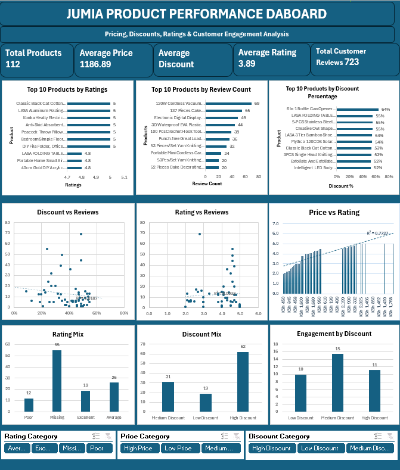

# Jumia Product Performance Dashboard

## Excel E-commerce Product Analysis Project

This project demonstrates an end-to-end **Excel data analytics workflow** using a Jumia product dataset. The project moves from raw data auditing and cleaning through analytical enrichment, PivotTable analysis, visualization and an interactive Excel dashboard.

The final dashboard focuses on **product pricing, discounts, customer ratings and review engagement** and is designed to help a seller or e-commerce analyst quickly identify patterns, potential promotional opportunities and products that may require further investigation.

------------------------------------------------------------------------

## Project Objective

The objective of this project was to transform a raw Jumia product dataset into a clean, structured and interactive Excel analysis that can answer practical business questions such as:

-   How do discount levels relate to customer review engagement?
-   Do higher-priced products receive better customer ratings?
-   Is there a relationship between product rating and review count?
-   Which products receive the highest review engagement?
-   Which products combine excellent ratings with strong engagement?
-   Which highly discounted products also have low ratings and may require investigation?
-   How can an interactive dashboard make these patterns easier to explore?

The project also demonstrates practical use of:

-   Power Query
-   Excel Tables
-   Structured-reference formulas
-   Descriptive statistics
-   Quartiles and percentiles
-   Correlation analysis
-   PivotTables
-   PivotCharts
-   Scatter plots and trendlines
-   Slicers and Report Connections
-   KPI cards
-   Business insight generation
-   Data-quality documentation

------------------------------------------------------------------------

## Dataset Overview

The original dataset contained **115 rows and 6 columns**.

  | Field        |   Description |
  |---------------|  -------------------------------|
  | Product     |     Product/listing name   |
  | Current price  |  Current selling price   |
  | Old price  |      Previous/list price   |
  | Discount   |      Product discount percentage   |
  | Review    |       Number of product reviews   |
  | Ratingd   |       Product rating stored as text   |

After cleaning and duplicate removal, the analytical dataset contained
**112 records**.

The original data is preserved separately from the cleaned analytical table so that the transformation process remains auditable.

------------------------------------------------------------------------

## Business Questions

The analysis was designed around the following questions:

1.  What is the overall pricing, discount, rating, and review profile of the products?
2.  How does average review engagement differ across discount categories?
3.  How do average ratings differ across price categories?
4.  Is product rating strongly related to review engagement?
5.  Which products have the highest review counts?
6.  Which products combine high ratings with high engagement?
7.  Which highly discounted products also have low ratings?
8.  Which products combine high discounts with high ratings?
9.  What business actions can reasonably be recommended from the available evidence?

------------------------------------------------------------------------

## Tools Used

  -----------------------------------------------------------------------
  | Tool / Feature   |                   Purpose    |
  | ----------------------------------- | -----------------------------------| 
  | Microsoft Excel    |         Main analysis and dashboard environment   |
  | Power Query    |  Data import, profiling, cleaning, transformation, and duplicate removal |
  | Excel Tables         |          Structured analytical dataset (`tblProducts`)  |
  | Excel formulas          |     Derived metrics, categories,thresholds, and flags   |
  | PivotTables              |           Product/category aggregation and analysis   |
  | PivotCharts             |          Interactive dashboard visualizations   |
  | Scatter Plot         |        Rating vs Review relationship   |
  | Slicers            |    Interactive filtering by Rating, Price, and Discount categories  |
  | Data Dictionary    |  Documentation of fields, assumptions, audit results, and cleaning decisions |
  -----------------------------------------------------------------------


# Data Preparation and Cleaning

## Initial Data-quality Audit

Before performing analysis, the dataset was profiled in Power Query using **Column Quality, Column Distribution and Column Profile**.
 
The audit identified the following:

 | Data-quality Check            |                Result   |
 | -------------------------------------------- | -------- |
 | Source rows                          |             115  |
 | Source columns               |                 6     |
 | Blank Review values       |             58   |
 | Blank Rating values        |           58    |
 | Populated Review values stored as negative   |      57    |
 | Current Price range values        |            1   |
 | Old Price range values            |         1       |
 | Duplicate excess rows removed     |         3     |
 | Discount values outside 0--100%    |        0     |
 | Rating values outside 0--5 after cleaning    |    0     |
 | Power Query errors after cleaning         |       0  |

After cleaning:

  | Final Check                    |          Result      |
  |--------------------------------------| ------------ |
  | Cleaned rows                    |         112   |
  | Complete Rating + Review records   |      57  |
  | Missing both Rating + Review    |       55   |
  | Current Price greater than Old Price    |    0  |
  | Power Query errors      |       0      |

------------------------------------------------------------------------

## Cleaning Decisions

### 1. Product Names

`Product` was cleaned using **Trim** and **Clean** in Power Query.

Repeated product names were not automatically removed because a repeated product name does not necessarily mean that the entire analytical record is a duplicate.

------------------------------------------------------------------------

### 2. Current Price

Currency text and commas were removed and the field was converted to a numeric data type.

One source value was a range:

``` text
KSh 1,620 - KSh 1,980
```

The midpoint was used:

``` text
(KSh 1,620 + KSh 1,980) / 2 = KSh 1,800
```

This assumption is documented in the workbook.

------------------------------------------------------------------------

### 3. Old Price

The same cleaning process was applied to `Old Price`.

One value appeared as:

``` text
KSh 2,200 - KSh 3,200
```

The midpoint was used:

``` text
(KSh 2,200 + KSh 3,200) / 2 = KSh 2,700
```

------------------------------------------------------------------------

### 4. Discount

Power Query correctly interpreted the Discount field as a percentage.

The valid range was:

``` text
1% to 64%
```

No additional scaling was required.

------------------------------------------------------------------------

### 5. Review

All 57 populated Review values were negative in the source data.

Because a review count cannot logically be negative, the negative sign was treated as a data collection/scraping artifact and **Absolute Value** was applied.

Missing Review values were intentionally left blank rather than converted to zero.

This distinction is important:

-   **Blank** = information is unavailable.
-   **0** = product is known to have zero reviews.

------------------------------------------------------------------------

### 6. Rating

The original `Ratingd` field contained text such as:

``` text
4.5 out of 5
```

The column was renamed to `Rating`, the text `out of 5` was removed and the result was converted to a decimal number.

The final valid rating range was:

``` text
2.0 to 5.0
```

Missing ratings remained blank.

------------------------------------------------------------------------

### 7. Duplicate Removal

Duplicates were evaluated using the six analytical source fields:

-   Product
-   Current Price
-   Old Price
-   Discount
-   Review
-   Rating

Three redundant rows were removed.

This reduced the dataset from:

``` text
115 rows → 112 rows
```

Products were **not** deduplicated by product name alone.

------------------------------------------------------------------------

### 8. Data Status

A `Data Status` field was added to distinguish complete and incomplete customer feedback records.
 
``` excel
=IF(AND(Review="",Rating=""),"Missing review & rating",...)
```

The final result was:

-   **57 Complete**
-   **55 Missing review & rating**

This field was also useful when filtering analyses that require both Rating and Review.

------------------------------------------------------------------------

# Analytical Enrichment and Excel Formulas

The cleaned Excel table was named:

``` text
tblProducts
```

The final analytical table contains the cleaned source fields plus derived columns for segmentation and performance analysis.

------------------------------------------------------------------------

## Discount Amount

Discount Amount measures the monetary difference between Old Price and Current Price.

``` excel
=[@[Old Price]]-[@[Current Price]]
```

------------------------------------------------------------------------

## Rating Category

Ratings were grouped into:

-   **Poor:** below 3
-   **Average:** 3 to 4.5
-   **Excellent:** above 4.5
-   **Missing:** no rating available

Formula:

``` excel
=IF([@Rating]="","Missing",IF([@Rating]<3,"Poor",IF([@Rating]<=4.5,"Average","Excellent")))
```

The Average category was extended through 4.5 so that every valid rating belongs to a category.

------------------------------------------------------------------------

## Discount Category

Discounts were classified as:

-   **Low Discount:** below 20%
-   **Medium Discount:** 20%--40%
-   **High Discount:** above 40%

Formula:

``` excel
=IF([@Discount]="","Missing",IF([@Discount]<20%,"Low Discount",IF([@Discount]<=40%,"Medium Discount","High Discount")))
```

------------------------------------------------------------------------

## Price Category

Price categories were based on the first and third quartiles of Current Price.

### First Quartile

``` excel
=QUARTILE.INC(tblProducts[Current Price],1)
```

Result:

``` text
Q1 = KSh 493
```

### Third Quartile

``` excel
=QUARTILE.INC(tblProducts[Current Price],3)
```

Result:

``` text
Q3 = KSh 1,669.50
```

The thresholds were stored as named cells:

``` text
Price_Q1
Price_Q3
```

Price Category formula:

``` excel
=IF([@[Current Price]]<=Price_Q1,"Low Price",IF([@[Current Price]]<=Price_Q3,"Medium Price","High Price"))
```

This created:

-   Low Price: ≤ KSh 493
-   Medium Price: \> KSh 493 and ≤ KSh 1,669.50
-   High Price: \> KSh 1,669.50

------------------------------------------------------------------------

## Engagement Flag

The 75th percentile of Review count was used as the High Engagement threshold.

``` excel
=QUARTILE.INC(tblProducts[Review],3)
```

Result:

``` text
Review P75 = 14
```

The threshold was stored as:

``` text
Review_P75
```

Formula:

``` excel
=IF([@Review]="","Missing",IF([@Review]>=Review_P75,"High Engagement","Low Engagement"))
```

Therefore:

-   **High Engagement:** 14 or more reviews
-   **Low Engagement:** fewer than 14 reviews
-   **Missing:** Review unavailable

Review count is an engagement proxy, not a sales measure.

------------------------------------------------------------------------

## Performance Flags

Three independent performance flags were created.

### High Rating + High Engagement

``` excel
=IF(AND([@[Rating Category]]="Excellent",[@[Engagement Flag]]="High Engagement"),"Yes","No")
```

### High Discount + Low Rating

``` excel
=IF(AND([@[Discount Category]]="High Discount",[@[Rating Category]]="Poor"),"Yes","No")
```

### High Discount + High Rating

``` excel
=IF(AND([@[Discount Category]]="High Discount",[@[Rating Category]]="Excellent"),"Yes","No")
```

These are independent screening flags, so their totals should not automatically be added together as unique products.

------------------------------------------------------------------------

# Analysis Workflow

## Descriptive Statistics

Descriptive statistics were calculated for:

-   Current Price
-   Old Price
-   Discount
-   Review
-   Rating

The analysis included:

``` excel
=AVERAGE(...)
=MEDIAN(...)
=MIN(...)
=MAX(...)
=COUNT(...)
```

Because Review and Rating contain missing values, their valid numeric count was **57** while Current Price, Old Price and Discount contained **112** valid observations.

------------------------------------------------------------------------

## Overall KPI Results

  | KPI                  |           Result   |
  |-----------------------| -------------- |
  | Total Products       |         112  |
  | Average Current Price  |   KSh 1,186.89   |
  | Average Discount      |        37%   |
  | Average Rating       |       3.89    |
  | Average Reviews      |      13       |

------------------------------------------------------------------------

## Discount Performance Analysis

  | Discount Category  |   Product Count  |  Avg Discount  |  Avg Reviews  |
  | -------------------| --------------- | -------------- | -------------- |
  | Low Discount       |              19    |         8%   |         10    |
  | Medium Discount    |              31     |       31%    |        15    |
  | High Discount      |              62     |      48%     |       11     |
  | **Total**         |         **112**   |     **37%**     |   **13**     |

### Interpretation

Medium-discount products recorded the highest average Review count at **15** compared with **11** for high-discount products and **10** for low-discount products.

This means that deeper discounts were **not associated with the highest observed engagement** in this dataset.

It does **not** prove that medium discounts cause higher engagement.

------------------------------------------------------------------------

## Price Performance Analysis

  |Price  Category | Products | Avg Current Price  |Avg Discount |Avg Reviews | Avg Rating |                                               
  | ----------- | ------------ |------------| ------------| ------------| ------------|
  | Low Price       |      28  | KSh 284.75   |       48%      |     17   |     3.64   |
  | Medium  Price  |       56   |  KSh 1,073.84      |   36%      |    10    |     3.88     |                                                     
  | High Price       |     28 |     KSh 2,315.14  |        27%        |   13    |    4.08     |
  |  **Total**      |  **112**     |   **KSh   1,186.89**   |     **37%**  |     **13**   |  **3.89**   |
                                                   
  ----------------------------------------------------------------------------

### Interpretation

Low-priced products had the highest average review engagement while high-priced products had the highest average rating and the lowest average discount.

Average Rating increased across the price categories:

``` text
Low Price      3.64
Medium Price   3.88
High Price     4.08
```

This is an association and does not show that higher prices cause better ratings.

------------------------------------------------------------------------

## Rating and Engagement Analysis

For the **57 products with complete Rating and Review information**:

  | Rating Category  |   High Engagement  | Low Engagement  |  Total    |
  | -----------------|  -----------------| ---------------- | --------  |
  | Poor          |                    4        |        8    |   12     |
  | Average       |                    6       |        20    |   26     |
  | Excellent     |                    6        |       13    |   19     |
  | **Total**     |               **16**       |   **41**   |    **57**  |

The distribution does not show a simple relationship in which better ratings automatically correspond to higher review engagement.

------------------------------------------------------------------------

## Correlation Analysis

Pearson correlation was calculated using:

``` excel
=CORREL(tblProducts[Rating],tblProducts[Review])
```

Result:

``` text
r ≈ 0.06
```

The scatter plot trendline produced approximately:

``` text
R² ≈ 0.0033
```

This indicates an **extremely weak positive linear relationship** between Rating and Review count.

A high product rating therefore does not necessarily correspond with a high number of reviews in this dataset.

------------------------------------------------------------------------

## Performance Flag Results

  | Performance Flag         |         Products     |
  | -------------------------------|  ----------    |
  | High Rating + High Engagement    |         6   |
  | High Discount + Low Rating       |     10      |
  | High Discount + High Rating      |        8    |

These groups were created to make it easier to identify products for further investigation.

------------------------------------------------------------------------

# PivotTable Workflow

PivotTables were used to summarize the analytical table without modifying the underlying data.
 
The main PivotTables included:

### Discount Performance

``` text
Rows:
Discount Category

Values:
Count of Product
Average of Discount
Average of Review
```

### Price Performance

``` text
Rows:
Price Category

Values:
Count of Product
Average of Current Price
Average of Discount
Average of Review
Average of Rating
```

### Rating × Engagement

``` text
Rows:
Rating Category

Columns:
Engagement Flag

Values:
Count of Product
```

Missing feedback records were excluded when the analysis specifically required Rating and Review.

### Top 10 Products by Review Count

A dedicated PivotTable was used for the Top 10 chart.

``` text
Rows:
Product

Values:
Max of Review

Filter:
Top 10 by Review Count
```

`Max of Review` was used rather than summing Review values because repeated product names may occur in the dataset and summing could
overstate engagement.

The chart is therefore described as:

> **Top 10 Products by Review Count**

and not as "best-selling products."

------------------------------------------------------------------------

# Dashboard

The final dashboard provides a one-page overview of the main findings.

## KPI Cards

The dashboard contains five KPI cards:

-   **Total Products:** 112
-   **Average Price:** KSh 1,186.89
-   **Average Discount:** 37%
-   **Average Rating:** 3.89
-   **Average Reviews:** 723

------------------------------------------------------------------------

## Dashboard Visuals

Nine charts were selected to keep the dashboard focused.

1. **Top 10 Products by Ratings**
2. **Top 10 Products by Review Count**
3. **Top 10 Products by Discount Percentage**
4. **Discount vs Reviews**
5. **Rating vs Reviews**
6. **Price vs Rating**
7. **Rating mix**
8. **Discount mix**
9. **Engagement by Discount**

------------------------------------------------------------------------

## Interactive Slicers

Three slicers were added:

-   **Rating Category**
-   **Price Category**
-   **Discount Category**

The slicers were connected to compatible PivotTables using:

``` text
Slicer → Report Connections / PivotTable Connections
```

This allows users to interactively explore different product segments.

The Rating vs Review scatter plot is a standard XY chart rather than a PivotChart, so it remains an overall analytical view rather than responding directly to PivotTable slicers.

The KPI cards also represent the overall dataset.

------------------------------------------------------------------------

## Dashboard Preview

Add your exported dashboard screenshot to the repository at:

``` text
images/dashboard.png
```

Then use:

``` md

```

------------------------------------------------------------------------

# Key Findings and Business Insights

Each finding is presented using **Evidence → Meaning → Action → Caveat**.

## 1. Medium Discounts Showed the Highest Average Review Engagement

**Evidence:** Medium-discount products averaged **15 reviews** compared with **11 reviews** for high-discount products and **10 reviews** for low-discount products.

**Meaning:** The deepest discounts were not associated with the strongest review engagement.

**Action:** Sellers can test medium and high discount bands and compare engagement before assuming that larger discounts will produce a stronger response.

**Caveat:** Review count is only a customer-engagement proxy. Sales and listing-age information are unavailable, so this relationship should not be interpreted as causal.

------------------------------------------------------------------------

## 2. Higher-priced Products Had Stronger Average Ratings

**Evidence:** Average Rating increased from **3.64** for Low Price products to **3.88** for Medium Price products and **4.08** for High Price products.

**Meaning:** Higher-priced products in this dataset tended to receive stronger customer ratings.

**Action:** Investigate the brands, product features, quality, and listing characteristics associated with highly rated high-priced products to determine whether useful practices can be applied elsewhere.

**Caveat:** The analysis identifies an association. It does not establish that increasing price causes higher customer ratings.

------------------------------------------------------------------------

## 3. Rating and Review Engagement Were Almost Unrelated

**Evidence:** Rating and Review count produced a correlation of approximately **r = 0.06**, with **R² ≈ 0.0033**.

**Meaning:** Highly rated products do not necessarily receive more review engagement.

**Action:** Evaluate products using both rating quality and engagement rather than relying on Rating alone.

**Caveat:** Only **57 products** had complete Rating and Review information, and Review count does not measure actual sales.

------------------------------------------------------------------------

## 4. Performance Flags Identified Opportunities and Risks

**Evidence:**

-   6 products were **High Rating + High Engagement**
-   10 products were **High Discount + Low Rating**
-   8 products were **High Discount + High Rating**

**Meaning:** The data contains both potentially attractive promotional candidates and products where heavy discounting appears alongside weaker ratings.

**Action:** Investigate the 6 high-rating/high-engagement products as possible promotional candidates and review product quality or listing issues among the 10 high discount/low-rating products before increasing promotional support.

**Caveat:** These flags are screening tools rather than proof of commercial performance because the dataset contains no revenue, units sold, margin or profitability information.

------------------------------------------------------------------------

# Business Recommendations

Based strictly on the completed analysis:

### Test Discount Bands

Medium-discount products showed the strongest average Review count. Sellers should compare medium and high discount strategies rather than assuming deeper discounts automatically produce better engagement.

### Investigate Stronger-rated High-price Products

High-price products achieved the strongest average Rating. Their product characteristics, brands, quality and listing presentation can be investigated to understand what may contribute to positive customer feedback.

### Use Rating and Engagement Together

Because Rating and Review count had almost no linear correlation, neither metric should be used alone as a complete measure of product performance.

### Review High-discount / Low-rating Products

The 10 products combining High Discount with Poor Rating deserve further investigation before additional promotional support is applied. Possible areas to investigate include product quality, customer expectations and listing accuracy.

### Investigate High-rating / High-engagement Products

The 6 products combining Excellent Rating with High Engagement are useful candidates for further analysis and potentially for targeted visibility or promotional testing.

------------------------------------------------------------------------

# Limitations

This project has several important limitations.

### Missing Customer-feedback Data of the 112 cleaned records:

``` text
57 = Complete Rating + Review
55 = Missing Rating + Review
```

Analyses involving customer feedback are therefore based on a smaller subset of the dataset.

### No Listing Age

A product with more reviews may simply have been listed for longer. Listing age is unavailable.

### Correlation Is Not Causation

The relationships observed between Price, Discount, Rating and Review count are associations only.

### Price-range Assumptions

Two source price ranges were converted to midpoints to make them analytically usable. This assumption may not represent the exact transaction/listing price for every variation within those ranges.

------------------------------------------------------------------------

# Workbook Structure

The Excel workbook is organized into six main sheets.

 | Sheet                    |           Purpose           |
 |-----------------------------------|-----------------------------------|
 | `Raw_Data`              |            Original source data retained for auditability    |

 | `Cleaned_Data`          |          Cleaned analytical table (`tblProducts`) and enrichment fields    |

 | `Analysis`              |           Descriptive statistics, thresholds, category summaries, correlation and performance flags  |

 | `Pivot_Tables`          |             PivotTables supporting detailed analysis and dashboard charts   |

 | `Dashboard`             |          Interactive KPI cards, charts, slicers, insights, and recommendations     |

 | `Data_Dictionary`       |         Data-quality audit, cleaning log, field definitions, assumptions, and thresholds     |

------------------------------------------------------------------------

# How to Open and Use the Workbook

## Requirements

For the best experience, open the workbook using a desktop version of **Microsoft Excel** that supports:

-   Power Query
-   PivotTables
-   PivotCharts
-   Slicers
-   Structured Excel Tables

## Steps

1.  Download or clone this repository.
2.  Open:

``` text
workbook/Jumia_Product_Performance_Dashboard.xlsx
```

3.  If Excel displays a security or external-content warning, review the workbook and enable the required content only if you trust the downloaded repository.
4.  Open the `Dashboard` sheet for the main interactive view.
5.  Use the **Rating Category**, **Price Category** and **Discount Category** slicers to explore product segments.
6.  Use the slicer's **Clear Filter** button to return to the overall view.
7.  Open `Analysis` to review the supporting calculations and thresholds.
8.  Open `Pivot_Tables` to inspect the PivotTables behind the dashboard charts.
9.  Open `Cleaned_Data` to inspect the final analytical table and formulas.
10. Open `Data_Dictionary` to review cleaning assumptions, definitions and data-quality decisions.
11. Use `Raw_Data` to compare the transformed data with the original source.

If the workbook needs refreshing, use:

``` text
Data → Refresh All
```

After refreshing, confirm that PivotTables, charts and slicers still display correctly.

------------------------------------------------------------------------

# Key Skills Demonstrated

This project demonstrates practical skills in:

-   Data-quality auditing
-   Power Query data cleaning
-   Data transformation
-   Handling missing values
-   Duplicate identification
-   Data validation
-   Excel structured references
-   Business-rule development
-   Quartile and percentile analysis
-   Descriptive statistics
-   Correlation analysis
-   PivotTables
-   PivotCharts
-   Scatter plots and trendlines
-   Slicer connections
-   Dashboard layout and KPI design
-   Business insight generation
-   Evidence-based recommendations
-   Analytical caveats and documentation

------------------------------------------------------------------------

# Lessons Learned

A major lesson from this project was that dashboard quality depends on the work completed **before** visualization.

Cleaning decisions such as handling negative Review values, converting price ranges, retaining missing values as blanks and correctly defining duplicates directly affect the reliability of the final analysis.

The project also reinforced that analytical categories need clearly documented rules. The Price Category and Engagement Flag were based on calculated dataset thresholds rather than arbitrary labels.

Another important lesson was the difference between **correlation and causation**. A dashboard can show that two measures move together or do not but that alone does not explain why.

Finally, I learned that a useful dashboard should not contain every calculation. Detailed calculations and PivotTables belong in supporting sheets, while the dashboard should communicate the most important KPIs, comparisons, filters and insights clearly.

------------------------------------------------------------------------

# Future Improvements

With a richer dataset, this project could be extended to include:

-   Sales volume and revenue
-   Gross margin and profitability
-   Product category and brand analysis
-   Listing age
-   Inventory availability
-   Advertising spend
-   Product impressions and clicks
-   Conversion rate
-   Time-series analysis
-   Discount elasticity
-   Revenue contribution by product
-   Profitability versus customer rating
-   Automated refresh from a larger source dataset

These additions would make it possible to move from engagement analysis toward a more complete e-commerce performance dashboard.

------------------------------------------------------------------------
